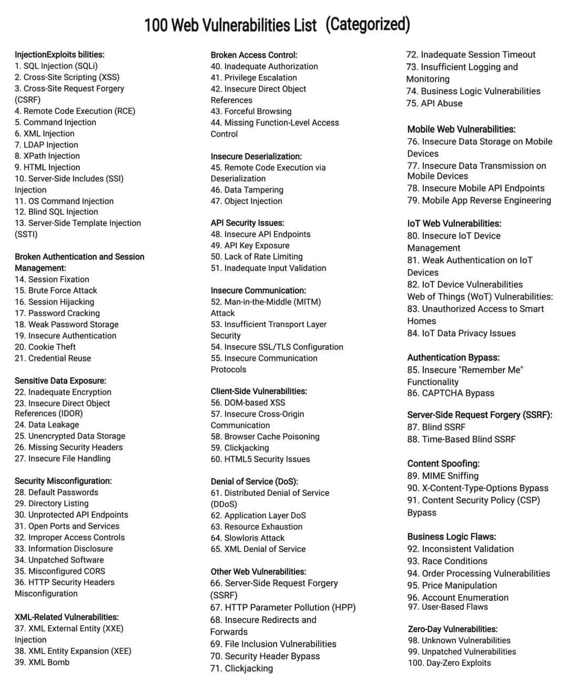

# 장경칩 연구소[ 블랙팔콘 대장 ] - 공개버전

github에 올려진 모든 연구자료는 연구용입니다.
악용시 전적으로 본인 책임입니다.

## 100취약점 리스트

# 프로그래밍의 도(道) 

##   The Tao of Programming 

        영역: 죠프리 제임스(Geoffrey James) 
                                  
        필사: 세쓰 로버트슨(Seth Robertson)
                                  
        번역 : 윤태원
                                  
### 목차 

 제 1 권 : 무(無) 
    
 제 2 권 : 고대(古代)의 도사(道士)들 
    
 제 3 권 : 설계(Design) 
    
 제 4 권 : 코딩(Coding) 
    
 제 5 권 : 유지(Maintenance) 
    
 제 6 권 : 관리(Management) 
    
 제 7 권 : 운용의 묘 
    
 제 8 권 : 하드웨어와 소프트웨어 
    
 제 9 권 : 에필로그 
    

