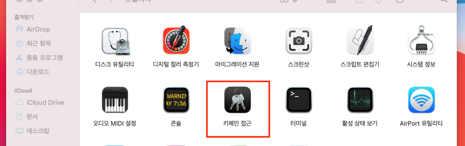
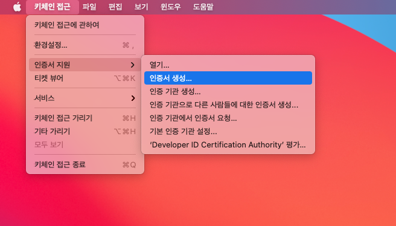
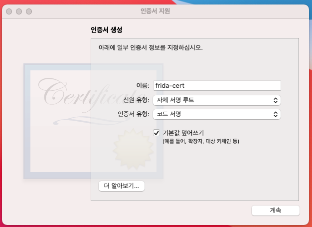
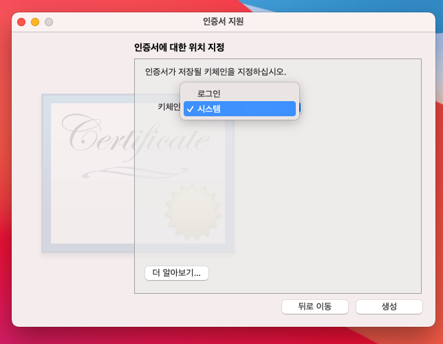
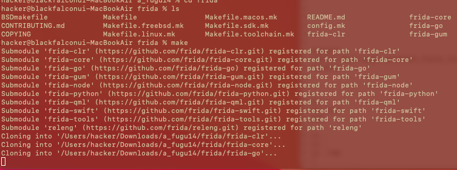
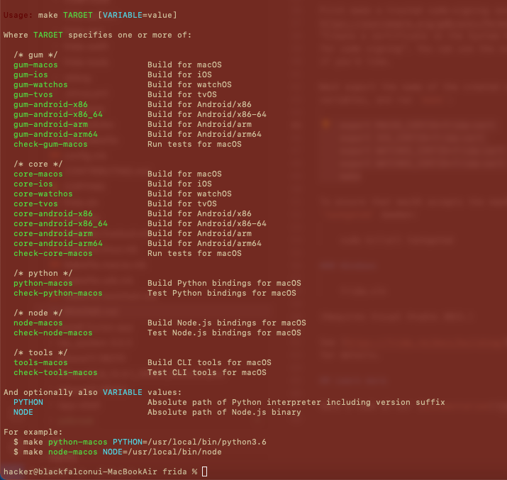
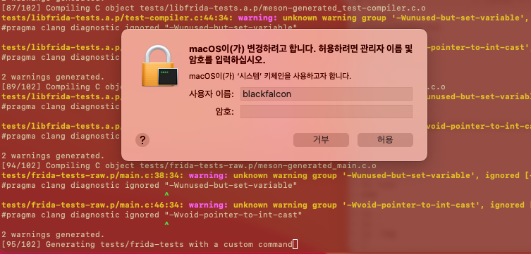
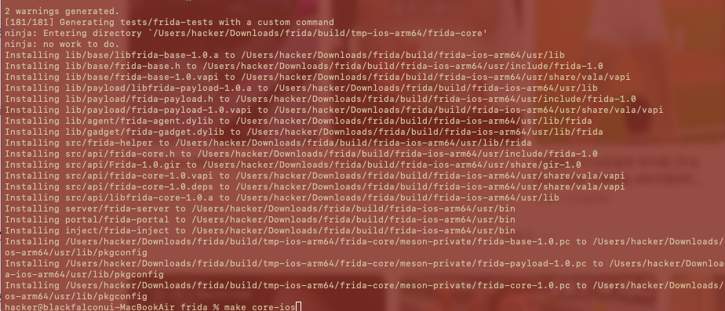

#  m1 macbook에서 ios용 frida 컴파일해보기

아들 교육용

## 참고 PermissionsDarwin
https://sourceware.org/gdb/wiki/PermissionsDarwin


## [+] frida-cert 인증서를 생성

### Keychain Access 애플리케이션 실행 




### 인증서 생성 

```
(/Applications/Utilities/Keychain Access.app)
메뉴에서 Keychain Access > Certificate Assistant >
Create a Certificate... 선택
```


### 인증서 생성 화면에서 아래 정보 입력:

```
Name: frida-cert
Identity Type: Self Signed Root
Certificate Type: Code Signing
좌측 하단의 Override defaults 체크
```


### Keychain을 System으로 설정
```
Continue 버튼을 여러번 클릭하면 "Specify a Location For The Certificate" 화면이 나옴. 
여기서 Keychain을 System으로 설정.
```

 
💡 만약 System 키체인에 인증서를 저장할 수 없다면, 
login 키체인에 우선 생성한 뒤 익스포트 후 System 키체인으로 임포트하는 방법도 있음.
인증서 생성이 완료되면 Keychain Access 종료하여 인증서 저장소 갱신
터미널에서 아래 명령어로 인증서가 잘 생성되었는지 확인:

### 인증서 확인
출력 결과에 "/Library/Keychains/System.keychain"이 보여야 함.

```
security find-certificate -c frida-cert
```


### 인증서 만료일 확인

아래 명려엉로 인증서 만료일 확인:

```
security find-certificate -p -c frida-cert | openssl x509 -checkend 0
```
이렇게 하면 코드 서명용 frida-cert 인증서 생성이 완료됩니다. 


## [+] frida 받고 빌드하기

```
git clone https://github.com/frida/frida.git
```
```
cd frida
```
```
export MACOS_CERTID=frida-cert
```

* ios만 컴파일 하려면 이것만 설정
```
export IOS_CERTID=frida-cert
```

```
export WATCHOS_CERTID=frida-cert
```
```
export WATCHOS_CERTID=frida-cert
```

```
make
```




### nodejs 설치

```
brew install node
```

### ios 컴파일
```
make core-ios
```

컴파일 중간에 관리자 암호 풀어본다.





```
ninja: no work to do.
Installing lib/base/libfrida-base-1.0.a to /Users/hacker/Downloads/a_fugu14/frida/build/frida-ios-arm64/usr/lib
Installing lib/base/frida-base.h to /Users/hacker/Downloads/a_fugu14/frida/build/frida-ios-arm64/usr/include/frida-1.0
Installing lib/base/frida-base-1.0.vapi to /Users/hacker/Downloads/a_fugu14/frida/build/frida-ios-arm64/usr/share/vala/vapi
Installing lib/payload/libfrida-payload-1.0.a to /Users/hacker/Downloads/a_fugu14/frida/build/frida-ios-arm64/usr/lib
Installing lib/payload/frida-payload.h to /Users/hacker/Downloads/a_fugu14/frida/build/frida-ios-arm64/usr/include/frida-1.0
Installing lib/payload/frida-payload-1.0.vapi to /Users/hacker/Downloads/a_fugu14/frida/build/frida-ios-arm64/usr/share/vala/vapi
Installing lib/agent/frida-agent.dylib to /Users/hacker/Downloads/a_fugu14/frida/build/frida-ios-arm64/usr/lib/frida
Installing lib/gadget/frida-gadget.dylib to /Users/hacker/Downloads/a_fugu14/frida/build/frida-ios-arm64/usr/lib/frida
Installing src/frida-helper to /Users/hacker/Downloads/a_fugu14/frida/build/frida-ios-arm64/usr/lib/frida
Installing src/api/frida-core.h to /Users/hacker/Downloads/a_fugu14/frida/build/frida-ios-arm64/usr/include/frida-1.0
Installing src/api/Frida-1.0.gir to /Users/hacker/Downloads/a_fugu14/frida/build/frida-ios-arm64/usr/share/gir-1.0
Installing src/api/frida-core-1.0.vapi to /Users/hacker/Downloads/a_fugu14/frida/build/frida-ios-arm64/usr/share/vala/vapi
Installing src/api/frida-core-1.0.deps to /Users/hacker/Downloads/a_fugu14/frida/build/frida-ios-arm64/usr/share/vala/vapi
Installing src/api/libfrida-core-1.0.a to /Users/hacker/Downloads/a_fugu14/frida/build/frida-ios-arm64/usr/lib
Installing server/frida-server to /Users/hacker/Downloads/a_fugu14/frida/build/frida-ios-arm64/usr/bin
Installing portal/frida-portal to /Users/hacker/Downloads/a_fugu14/frida/build/frida-ios-arm64/usr/bin
Installing inject/frida-inject to /Users/hacker/Downloads/a_fugu14/frida/build/frida-ios-arm64/usr/bin
Installing /Users/hacker/Downloads/a_fugu14/frida/build/tmp-ios-arm64/frida-core/meson-private/frida-base-1.0.pc to /Users/hacker/Downloads/a_fugu14/frida/build/frida-ios-arm64/usr/lib/pkgconfig
Installing /Users/hacker/Downloads/a_fugu14/frida/build/tmp-ios-arm64/frida-core/meson-private/frida-payload-1.0.pc to /Users/hacker/Downloads/a_fugu14/frida/build/frida-ios-arm64/usr/lib/pkgconfig
Installing /Users/hacker/Downloads/a_fugu14/frida/build/tmp-ios-arm64/frida-core/meson-private/frida-core-1.0.pc to /Users/hacker/Downloads/a_fugu14/frida/build/frida-ios-arm64/usr/lib/pkgconfig
hacker@blackfalconui-MacBookAir frida % 

```


