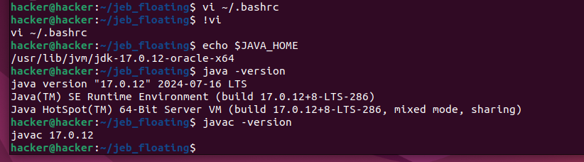

# JEB Floating License 시스템

이 문서는 JEB 플로팅 라이선스 시스템의 개요와 설치 방법을 제공합니다.

**write by SpeeDr00t**


* jeb 메뉴얼

```
https://www.pnfsoftware.com/jeb/manual/floating/
```

## JEB Controller 구조도

아래는 JEB 컨트롤러의 구조를 나타내는 다이어그램입니다:


## 주요 기능

- 플로팅 라이선스 관리
- 안전한 인증 및 라이선싱

## JEB Controller 설치 방법

### 1) 구매후 jeb 다운로드링크와 암호가 전달된다.


### 2) JDK 17버전 다운로드하고 설치한다.


```
sudo apt install alien -y
sudo apt install rpm -y
sudo alien -i jdk-17.0.12_linux-x64_bin.rpm

sudo vi ~/.bashrc
파일의 마지막에 아래 추가

export JAVA_HOME=/usr/lib/jvm/jdk-17.0.12-oracle-x64
export PATH=$JAVA_HOME/bin:$PATH

source  ~/.bashrc
```



### 3) JEB Controller 실행하기

앞서 이메일로 받은 암호를 넣는다.

```
./jeb_linux.sh -c --controller

```


### 4 ) Input your license key 입력 받는 대기화면 확인

license data를 복사한다.


### 5 ) JEB KEY GENERATOR

아래 사이트에 접속해서 

4)에서 복사한 license data와 원하는 key name을 입력한다.

```
pnfsoftware.com/genlk
```


### 6) 생성한 License key를 확인한다


### 7) License key 입력한다.

6)에서 생성한 License key를 복사해서 입력한다.

``
Input your license key : key
``


## JEB client 접속 방법

### 1) JEB client 실행하기

이메일에서 받은 암호 입력한다.

```
./jeb_linux.sh
```


### 2) JEB License 서버 접속하기

* host name은 JEB License서버가 설치된 아이피 설정

* port는 지정한 포트 설정


### 3) 실행확인

JEB 클라이언트에서 실행확인


JEB License 서버에서 client접속 확인

