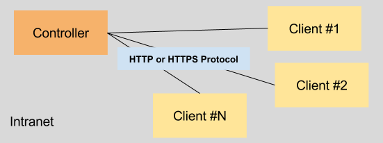
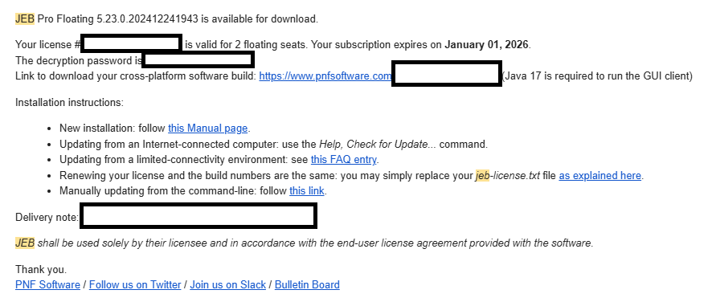

# JEB 플로팅 라이선스 시스템

이 문서는 JEB 플로팅 라이선스 시스템의 개요를 제공합니다.

## JEB Controller 구조도

아래는 JEB 컨트롤러의 구조를 나타내는 다이어그램입니다:

## 주요 기능

- 플로팅 라이선스 관리
- 안전한 인증 및 라이선싱
- 라이선스 추적을 위한 데이터베이스 스키마

## 사용 방법

1. 구매후 jeb 다운로드링크와 암호가 전달된다.

